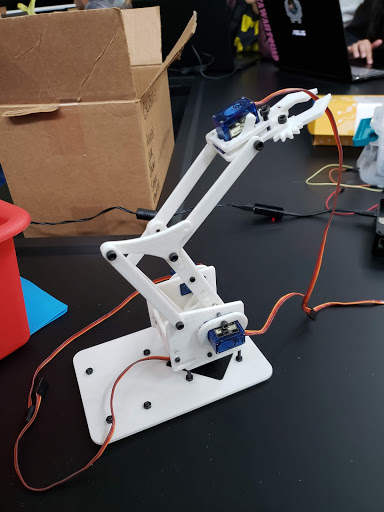
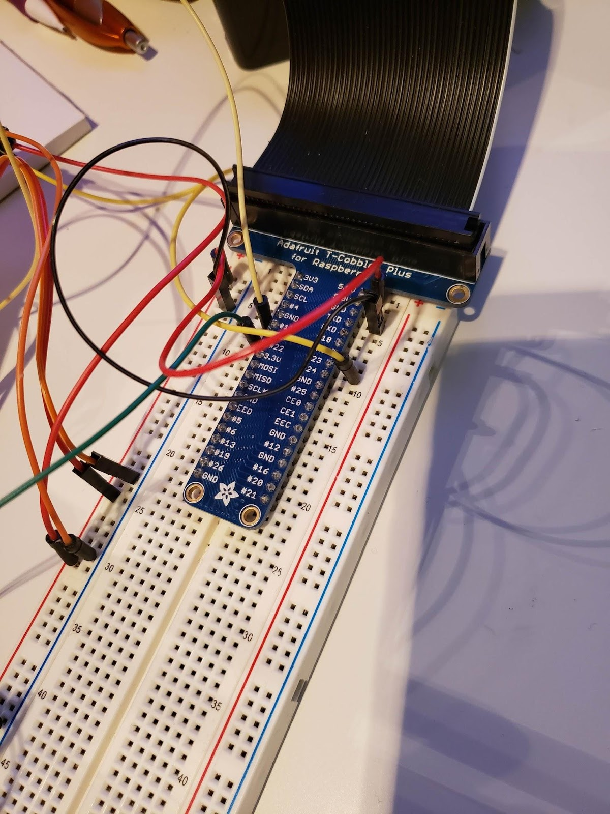
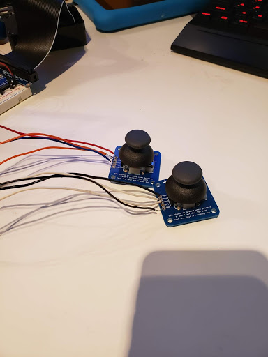
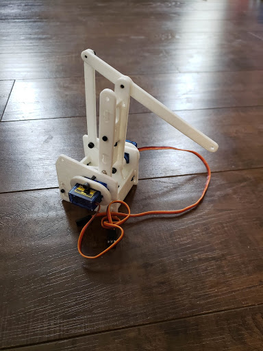

  
  
  
  

My team decided to make a robot arm for our Computer Architecture final. First, we 3D printed the parts, and then had one team member work on assembling the arm. A couple problems arose with the printed components. First, the holes were too small, so the person working on it used a dremel to make the holes larger. Some parts needed reprinting because they did not come out well. The materials we used to make the arm move were servos, screws, and joysticks. Originally, our robot arm had a gripper that would be able to pick things up, but the servo was not strong enough to make the arm grip. My job was to solder the wires on to the joysticks. It was my first time ever soldering something, so I learned something new. Another challenge came up with the joysticks, they would not connect with the pi and nobody could figure it out. We spent a great portion of our time trying to figure out the joysticks. Eventually, we coded a loop to just move the arm around without controls. We used Python on the Raspberry Pi and had to research how to use the libraries and how to program the joysticks. It was everyones first time using Raspberry Pi in my group so it was a learning experience for everyone. We had only a couple weeks to complete this project, so we did not get to fix everything we wanted to but it ended up being a great learning experience on all ends of the project.

